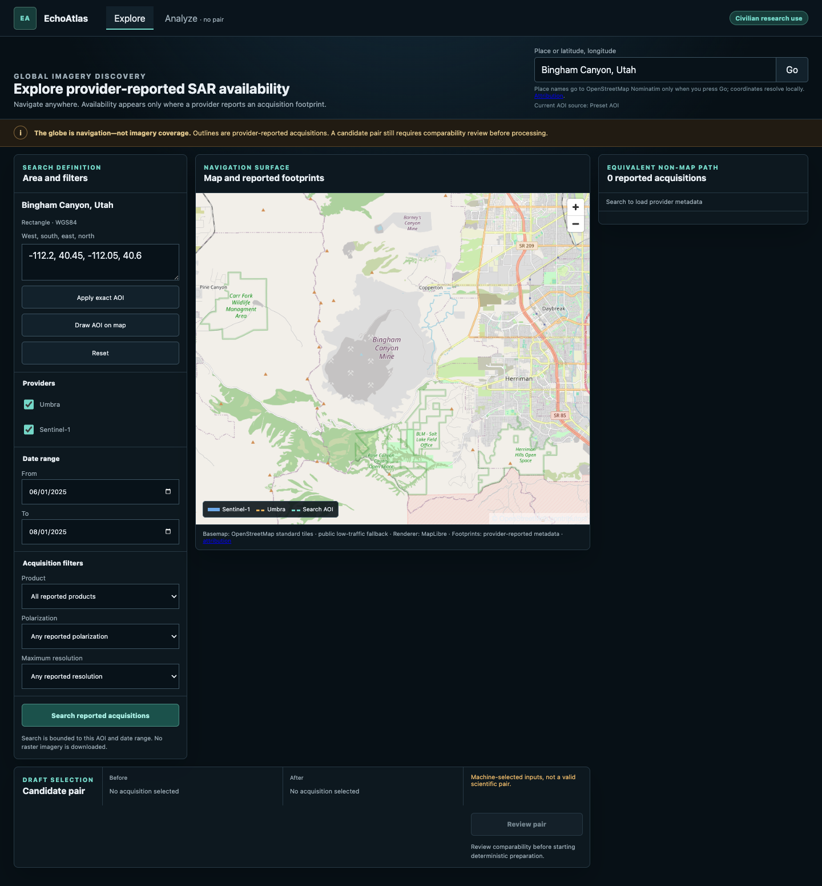
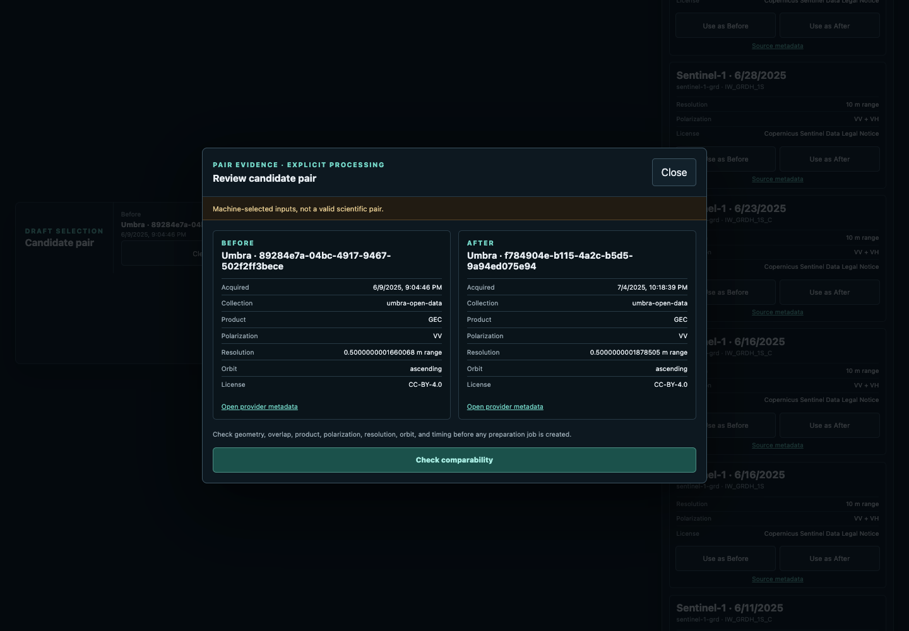
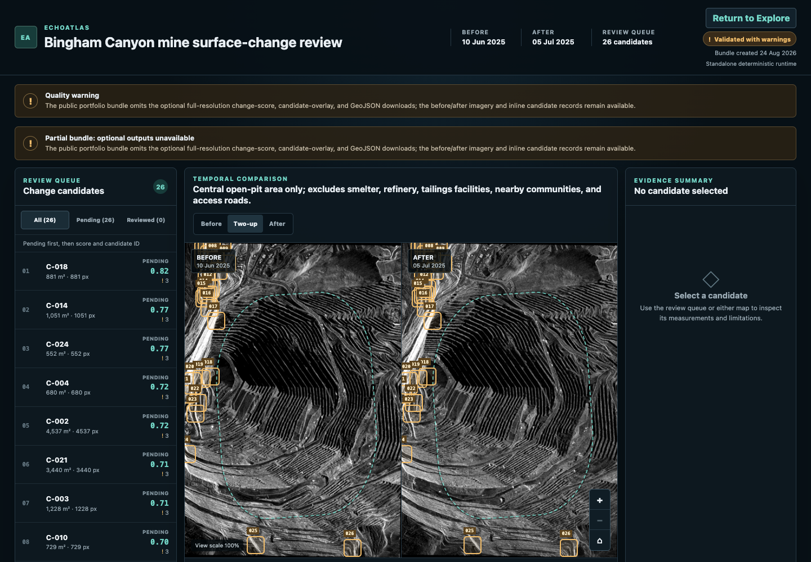

# EchoAtlas

**A truthful, human-in-the-loop SAR change-candidate workbench.** EchoAtlas lets
an analyst navigate the globe, inspect real provider catalog availability, review
a comparable acquisition pair, and examine deterministic change candidates with
their provenance and limitations intact.

> EchoAtlas produces machine-generated **candidates**, never confirmed change,
> damage, cause, identity, intent, or operational truth.

**[Open the public, login-free EchoAtlas portfolio deployment](https://earth-atlas-ai.vercel.app)**

## Explore anywhere; claim only what the data supports

Search for a place or draw a bounded area on the MapLibre globe. EchoAtlas queries
normalized Umbra and Sentinel-1 metadata, preserves real acquisition footprints,
keeps successful results when one provider fails, and offers an accessible list
for every map action. Global navigation does not imply global imagery coverage or
scientific suitability.



Before analysis, the pair-review step exposes temporal separation, overlap,
geometry, source identity, licensing, and warnings. The selection handed to the
backend is immutable.



## Inspect real public Umbra evidence

The approved Bingham Canyon demonstration uses two pinned public Umbra GEC
acquisitions. The deterministic pipeline downloads checksum-verified inputs,
crops them to the approved civilian AOI, aligns them on a declared common grid,
creates display derivatives, and generates a transparent queue of 26 review
candidates. Source identity, acquisition time, processing parameters, warnings,
artifact hashes, and CC BY 4.0 attribution stay visible.



An analyst can mark a candidate **Supported**, **Rejected**, or **Needs context**,
add a note, and later correct the decision. Events are append-only and persist in
the same browser and origin across reloads and container restarts. This local
history is owner-review convenience storage, not a multi-user audit service.

## What is actually shipped

| Shipped | Unavailable roadmap |
| --- | --- |
| MapLibre globe and accessible results | Calibrated SAR benchmark/accuracy claims |
| Umbra + Sentinel-1 metadata search | AI summaries or model calls |
| Comparability review and immutable handoff | Multi-user auth and durable assessment service |
| Deterministic local preparation pipeline | Operational monitoring or automatic alerts |
| Synthetic fallback and real prepared demo | Paid tasking or guaranteed global coverage |
| Browser-local append-only assessments | Live wildfire feeds and event matching |
| Native and non-root Docker workflows |  |

The standalone runtime is canonical and does not require an ontology platform,
OpenAI, or a private map key. The public Vercel deployment is a bounded portfolio
demonstration: it searches Sentinel-1 metadata and an explicit two-item Umbra
index, then opens the reduced approved Bingham Canyon bundle. Arbitrary raster
processing, operational monitoring, alerts, multi-user storage, scientific
validity claims, and AI remain unavailable. EAT-012 qualified SAR adjudication
is incomplete, so EAT-013 remains gated.

## Run the owner-review app with Docker

Requirements: Docker Desktop with Compose v2.

```sh
docker compose build
docker compose up --detach --wait
```

Open <http://127.0.0.1:8080>. The default path loads the clearly labeled
deterministic synthetic fallback and needs no account or credential.

To mount an already generated public-Umbra prepared bundle read-only:

```sh
docker compose -f compose.yaml -f compose.prepared.yaml up --detach --wait
```

See the [standalone demo runbook](docs/operations/standalone-demo.md) for fresh
setup, prepared-data staging, persistence, health checks, shutdown, and recovery.
Use the [scripted analyst story](docs/operations/analyst-story.md) for a concise
walkthrough.

## Native development

Requirements: Python 3.12–3.13, [uv](https://docs.astral.sh/uv/), Node.js 20.19+
and npm 10+.

```sh
make setup
make check
```

Start the API and web app in separate terminals:

```sh
make dev-api
make dev-web
```

The API health endpoint is <http://127.0.0.1:8000/health>; Vite prints the web
URL. See [CONTRIBUTING.md](CONTRIBUTING.md) and the
[Git/ticket workflow](plans/GIT_WORKFLOW.md) before changing code.

## Reproduce the public Umbra demonstration

The exact approved object identities, sizes, ETags, access evidence, and
CRC64NVME checksums are pinned in
`fixtures/demo/selection-manifest.v1.json`. The two inputs total about 524 MB and
stay in the Git-ignored `data/` cache.

```sh
uv run echoatlas-acquire \
  --manifest fixtures/demo/selection-manifest.v1.json \
  --data-root data

uv run echoatlas-process-previews \
  --manifest fixtures/demo/selection-manifest.v1.json \
  --data-root data
```

Use the preview run path printed by that command:

```sh
uv run echoatlas-change-candidates \
  --preview-run data/derived/echoatlas-bingham-canyon-2025-v1/<preview-run> \
  --data-root data

uv run echoatlas-prepare-workbench-demo \
  --selection-manifest fixtures/demo/selection-manifest.v1.json \
  --preview-run data/derived/echoatlas-bingham-canyon-2025-v1/<preview-run> \
  --change-run data/derived/echoatlas-bingham-canyon-2025-v1/changes/<change-run> \
  --output apps/workbench/public/generated-demo
```

The final staging step validates lineage, hashes, dimensions, quality evidence,
and all candidate records before atomically publishing display files to the local
workbench. It never commits raw imagery, caches, provider payloads, generated
real-data artifacts, credentials, or assessments.

## Architecture and trust boundary

- `services/backend` — FastAPI orchestration plus deterministic acquisition,
  raster, catalog, candidate, bundle, and evaluation domains.
- `apps/workbench` — React/TypeScript Explore and Analyze experience.
- `schemas` — strict, versioned portable analysis-bundle contracts.
- `fixtures` — source selections and synthetic contract fixtures, never raw SAR.
- `deploy` and `compose*.yaml` — pinned, non-root, health-checked local packaging.
- `plans` — product decisions, tickets, risks, and approval gates.

Provider payloads stop at validated adapters. Deterministic processing does not
depend on the UI, deployment vendor, or AI. The portable bundle is the contract
among the processor, workbench, and tests.

Start with the [architecture overview](docs/architecture/README.md),
[dataset card](docs/data/bingham-canyon-dataset-card.md),
[release evidence](docs/qa/release-evidence-v1.md), and
[planning package](plans/README.md).

## License and attribution

Source code is MIT licensed. Umbra imagery and qualifying derivatives remain
CC BY 4.0. Basemaps, catalog metadata, and other third-party material retain their
own terms. See [THIRD_PARTY_DATA.md](THIRD_PARTY_DATA.md); the MIT license does not
grant rights to third-party data.
