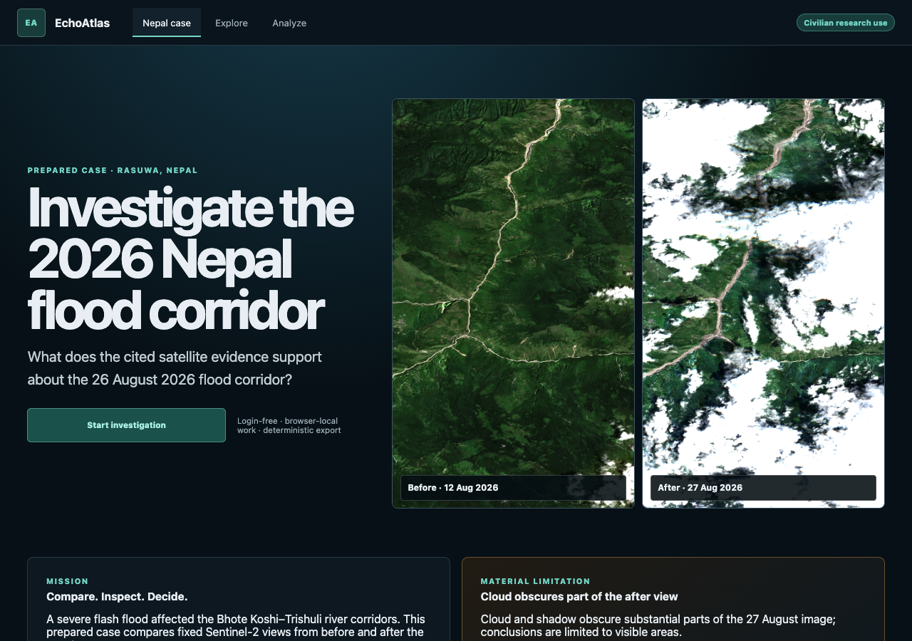
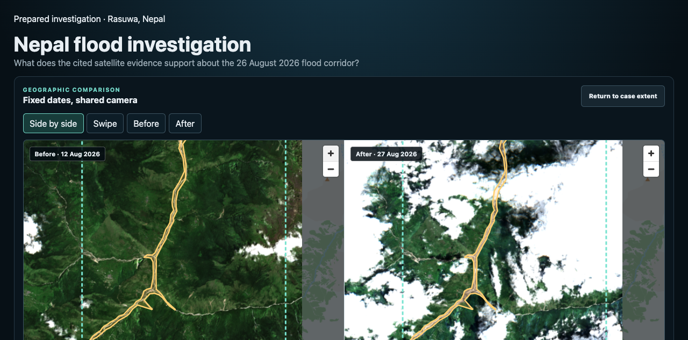
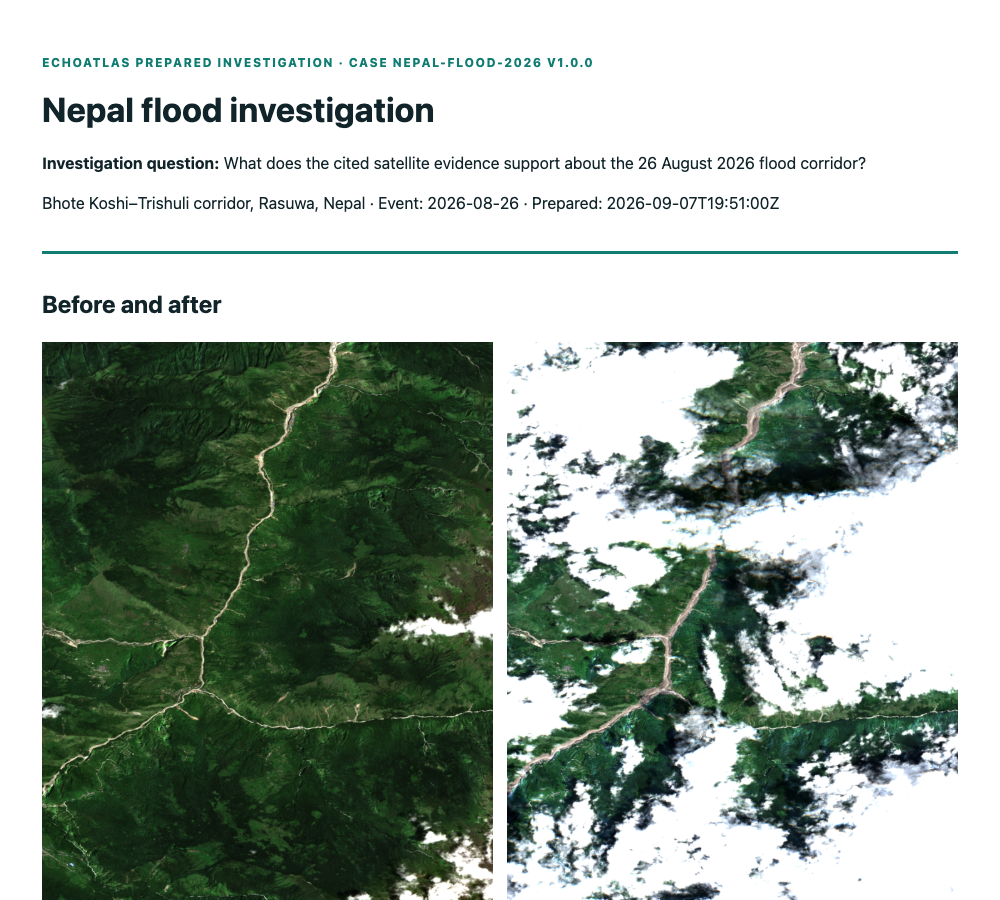
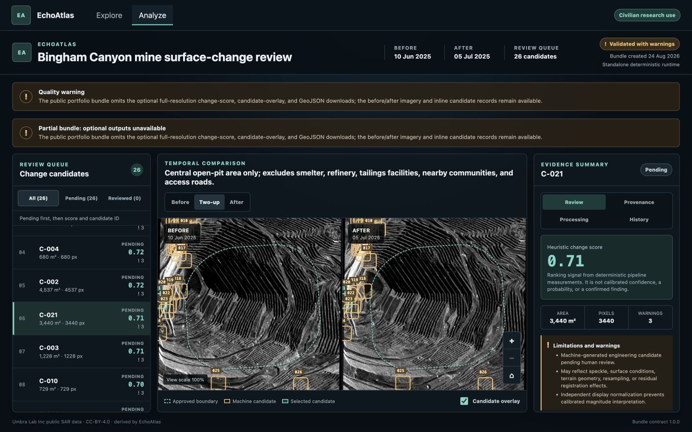

# EchoAtlas

**A source-grounded, human-led satellite investigation workbench.** EchoAtlas
opens on a prepared investigation of the 26 August 2026 Nepal flood corridor. A
reviewer can navigate geographically aligned before/after imagery, inspect cited
observations, record a separate assessment, and export a deterministic brief
without an account or model call.

> EchoAtlas preserves the boundary between published source observations and a
> reviewer's conclusions. It does not claim confirmed damage, cause, identity,
> intent, or operational truth.

**[Open the public, login-free EchoAtlas portfolio deployment](https://earth-atlas-ai.vercel.app)**

## Investigate the Nepal flood corridor

The primary case uses pinned Sentinel-2 L2A acquisitions from 12 and 27 August
2026 over the Bhote Koshi–Trishuli corridor in Rasuwa. MapLibre requests the
prepared Web Mercator tiles as the camera moves; panning changes location while
the two acquisition dates remain fixed. Coverage, transparent nodata, source
identity, attribution, and the heavy cloud limitation in the after scene remain
visible.



Desktop reviewers can use synchronized maps or swipe comparison. Narrow screens
use one map with before/after controls. The accessible observation list centers
the same geography and exposes the original cited evidence.



Assessments are browser-local, append-only, and scoped to the exact case version.
Printable HTML and JSON exports share one deterministic record with the imagery
dates, citations, assessment history, unresolved items, limitations, and
attribution.



## Explore anywhere; claim only what the data supports

Search for a place or draw a bounded area on the MapLibre globe. EchoAtlas queries
normalized Umbra and Sentinel-1 metadata, preserves real acquisition footprints,
keeps successful results when one provider fails, and offers an accessible list
for every map action. Global navigation does not imply global imagery coverage or
scientific suitability.


Before analysis, the pair-review step exposes temporal separation, overlap,
geometry, source identity, licensing, and warnings. The selection handed to the
backend is immutable.


## Inspect real public Umbra evidence

The approved Bingham Canyon demonstration uses two pinned public Umbra GEC
acquisitions. The deterministic pipeline downloads checksum-verified inputs,
crops them to the approved civilian AOI, aligns them on a declared common grid,
creates display derivatives, and generates a transparent queue of 26 review
candidates. Source identity, acquisition time, processing parameters, warnings,
artifact hashes, and CC BY 4.0 attribution stay visible.



An analyst can mark a candidate **Supported**, **Rejected**, or **Needs context**,
add a note, and later correct the decision. Events are append-only and persist in
the same browser and origin across reloads and container restarts. This local
history is owner-review convenience storage, not a multi-user audit service.

## What is actually shipped

| Shipped                                          | Unavailable roadmap                            |
| ------------------------------------------------ | ---------------------------------------------- |
| Prepared Nepal MapLibre investigation            | Arbitrary-area raster processing               |
| Synchronized, swipe, and single-date comparison  | Newly computed Nepal change candidates         |
| Cited observations and separate user assessments | AI summaries or model calls                    |
| Deterministic printable HTML and JSON brief      | Multi-user auth and durable assessment service |
| MapLibre globe and accessible results            | Calibrated SAR benchmark/accuracy claims       |
| Umbra + Sentinel-1 metadata search               | Operational monitoring or automatic alerts     |
| Comparability review and immutable handoff       | Automatic pair-validity claims                 |
| Deterministic local preparation pipeline         | Live imagery or continuous ingestion           |
| Synthetic fallback and real prepared demo        | Paid tasking or guaranteed global coverage     |
| Browser-local append-only assessments            | Live wildfire feeds and event matching         |
| Native and non-root Docker workflows             |                                                |

The standalone runtime is canonical and has no Palantir, ontology-platform,
OpenAI, or private-map-key requirement. The public Vercel deployment serves one
prepared Nepal case from static assets. Explore and the reduced Bingham Canyon
SAR demonstration remain secondary regression and portfolio capabilities.
Arbitrary raster processing, monitoring, alerts, multi-user storage, scientific
validity claims, and AI remain unavailable. EAT-012 qualified SAR adjudication
is incomplete, so EAT-013 and M3 remain gated.

## Run the owner-review app with Docker

Requirements: Docker Desktop with Compose v2.

```sh
docker compose build
docker compose up --detach --wait
```

Open <http://127.0.0.1:8080/analyze> for the clearly labeled deterministic
synthetic fallback. The Nepal root requires the prepared static case described
below.

To mount an already generated public-Umbra prepared bundle read-only:

```sh
docker compose -f compose.yaml -f compose.prepared.yaml up --detach --wait
```

See the [standalone demo runbook](docs/operations/standalone-demo.md) for fresh
setup, prepared-data staging, persistence, health checks, shutdown, and recovery.
Use the [scripted analyst story](docs/operations/analyst-story.md) for a concise
walkthrough.

## Native development

Requirements: Python 3.12–3.13, [uv](https://docs.astral.sh/uv/), Node.js 20.19+
and npm 10+.

```sh
make setup
make check
```

Start the API and web app in separate terminals:

```sh
make dev-api
make dev-web
```

The API health endpoint is <http://127.0.0.1:8000/health>; Vite prints the web
URL. See [CONTRIBUTING.md](CONTRIBUTING.md) and the
[Git/ticket workflow](plans/GIT_WORKFLOW.md) before changing code.

## Reproduce the Nepal prepared case

Follow the exact source downloads and checksums in the
[Nepal dataset card](docs/data/nepal-flood-2026-dataset-card.md), then run:

```sh
uv run --group processing python scripts/prepare_nepal_case.py
uv run --group processing python scripts/verify_nepal_case.py
```

The commands validate the pinned source hashes, common grid, five distributed
alignment checks, tile bounds, transparent nodata, thumbnails, and attribution.
Raw imagery and generated assets remain ignored by Git. Vite copies the prepared
case into a local build; `compose.prepared.yaml` mounts it read-only for Docker.

## Reproduce the secondary public Umbra demonstration

The exact approved object identities, sizes, ETags, access evidence, and
CRC64NVME checksums are pinned in
`fixtures/demo/selection-manifest.v1.json`. The two inputs total about 524 MB and
stay in the Git-ignored `data/` cache.

```sh
uv run echoatlas-acquire \
  --manifest fixtures/demo/selection-manifest.v1.json \
  --data-root data

uv run echoatlas-process-previews \
  --manifest fixtures/demo/selection-manifest.v1.json \
  --data-root data
```

Use the preview run path printed by that command:

```sh
uv run echoatlas-change-candidates \
  --preview-run data/derived/echoatlas-bingham-canyon-2025-v1/<preview-run> \
  --data-root data

uv run echoatlas-prepare-workbench-demo \
  --selection-manifest fixtures/demo/selection-manifest.v1.json \
  --preview-run data/derived/echoatlas-bingham-canyon-2025-v1/<preview-run> \
  --change-run data/derived/echoatlas-bingham-canyon-2025-v1/changes/<change-run> \
  --output apps/workbench/public/generated-demo
```

The final staging step validates lineage, hashes, dimensions, quality evidence,
and all candidate records before atomically publishing display files to the local
workbench. It never commits raw imagery, caches, provider payloads, generated
real-data artifacts, credentials, or assessments.

## Architecture and trust boundary

- `services/backend` — FastAPI orchestration plus deterministic acquisition,
  raster, catalog, candidate, bundle, and evaluation domains.
- `apps/workbench` — React/TypeScript Nepal investigation, Explore, and Analyze experience.
- `schemas` — strict, versioned portable analysis-bundle contracts.
- `fixtures` — source selections and synthetic contract fixtures, never raw SAR.
- `deploy` and `compose*.yaml` — pinned, non-root, health-checked local packaging.
- `plans` — product decisions, tickets, risks, and approval gates.

Provider payloads stop at validated adapters. Deterministic processing does not
depend on the UI, deployment vendor, or AI. The portable bundle is the contract
among the processor, workbench, and tests.

Start with the [architecture overview](docs/architecture/README.md),
[Nepal dataset card](docs/data/nepal-flood-2026-dataset-card.md),
[Nepal release-candidate evidence](docs/qa/nepal-release-candidate.md), and
[planning package](plans/README.md).

## License and attribution

Source code is MIT licensed. Umbra imagery and qualifying derivatives remain
CC BY 4.0. Basemaps, catalog metadata, and other third-party material retain their
own terms. See [THIRD_PARTY_DATA.md](THIRD_PARTY_DATA.md); the MIT license does not
grant rights to third-party data.
