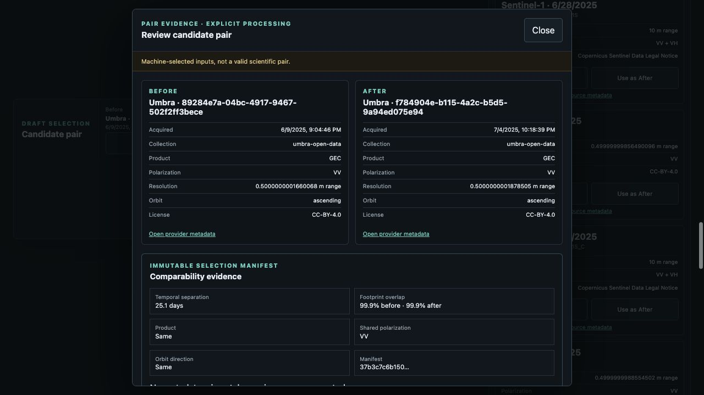
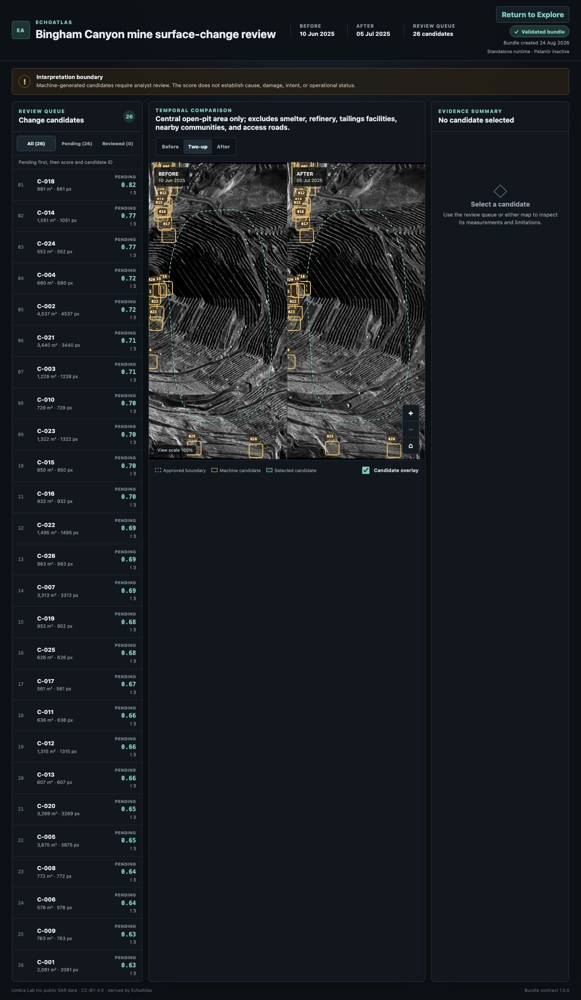

# Explore-to-Analyze verification

Date: 2026-08-25

Ticket: EAT-019

Branch: `feature/eat-019-explore-analyze`

## Automated evidence

- Backend tests cover content hashing, AOI hashing, before/after ordering, no-overlap rejection, Umbra and Sentinel source allowlists, provenance retention, prepared-bundle identity checks, success, safe failure, cancellation, retry, and bounded capacity.
- API tests cover all five analysis endpoints and the versioned OpenAPI surface.
- Workbench tests cover comparability before processing, runtime validation, the exact manifest resubmission, success handoff, return to Explore, active-job containment, cancellation, retry, no-comparable-pair behavior, and processing failure.
- The complete `make check` gate passes with 121 backend tests and 76 workbench tests, formatting, linting, type checks, production build, and secret scan. Backend line coverage is 84%; workbench line coverage is 84.5%. The production output remains inside the approved EAT-018 budget at 249.36 kB gzip for MapLibre, approximately 375.07 kB gzip for all emitted JavaScript, and 17.22 kB gzip for CSS.

## Live catalog and failure path

The local workbench queried real provider metadata over the approved Bingham Canyon AOI for 1 June through 1 August 2025. It returned 15 Sentinel-1 records and 10 spatially matching Umbra records. Umbra correctly reported a partial bounded sample. No raster acquisition was downloaded during search.

A live Sentinel-1 pair produced a content-hashed manifest and displayed 7.0 days temporal separation, 26.0%/26.6% footprint overlap, matching product/polarization/orbit evidence, and `Scientific validity: not determined`. Starting preparation entered the asynchronous job boundary and failed safely because the configured approved Umbra bundle did not match the Sentinel identities. Retry remained available.

## Approved Umbra success path

The real catalog results exposed the pinned, licensed pair:

- before `89284e7a-04bc-4917-9467-502f2ff3bece`, 10 June 2025;
- after `f784904e-b115-4a2c-b5d5-9a94ed075e94`, 5 July 2025.

The review displayed 25.1 days separation, 99.9% overlap in both directions, matching GEC/VV/ascending metadata, CC BY 4.0 licensing, exact provider links, an immutable manifest hash, and the explicit scientific-validity boundary before the processing action appeared.

The queued job succeeded only because the configured prepared bundle contained those exact acquisition IDs. Analyze then loaded the existing validated bundle with both 361×512 real-derived images, 26 machine-generated candidates, the approved central-pit sensitivity boundary, Umbra attribution, and a visible Return to Explore action.

These checks prove the bounded handoff and prepared evidence path. They do not prove calibrated SAR accuracy, scientific validity, global Umbra completeness, arbitrary on-demand raster processing, or operational deployment.
